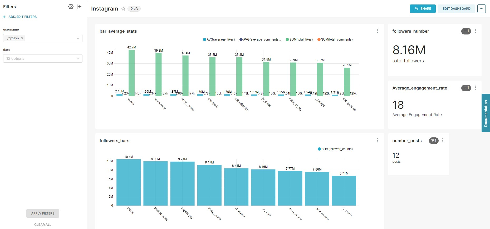

### What does my app do
- Retrieve data from Instagram profiles like followers count, like counts, medias...
- These data are then saved as csv files and export  manually to Preset.
- On Preset, we can create dashboards.

### Techs, softwares, librairies…
- Prefect
- Vscode 
- Github Desktop
- Discord
- Preset
- Instagrapi

### Limits
- The project uses free trials for Preset and Prefect.
- Instagrapi API is limited at 20 medias per run (for testing purpose). If go you try to run it with a higher number, Instagram may detects a suspicious behabiour and ask you a code. In this project, Instagram asks to solve a "submit_phone" challenge which seems does not seem to be handle by the api for the moment. See https://github.com/adw0rd/instagrapi/issues/1041
